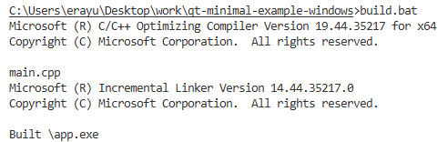
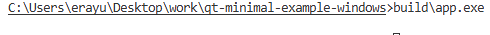
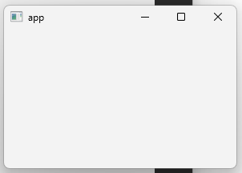

## Motivation
This is a minimal C++/Qt 6.10 program created for the Windows execution environment. This project is
pursued in order to clarify the build toolchain used in the Windows Operating System. Creating a binary 
executable with a fully custom batch file leaves no place for ambiguity and provides a clear lens into the 
underlying machinery.

Windows is a proprietary operating system, and it is not widely used in Web or IoT application programming.
GNU/Linux has dominated those areas, and it is considered more developer-friendly as an OS by the 
majority of developers. Anyways, Windows is still being widely used for personal computing, and a 
programmer expects creation of programs in its environment to be explainable from the first principles of 
the compiler, and OS theory. It turns out this is the case, and this project is the showcase of it.

## How things work
The batch file "build.bat" is used to automate target generation. That file automates the following steps:

1. Set up required environment variables to use the MSVC compiler stack by sourcing the batch file "vsvarsall.bat".
2. Configure standard compilation toolchain with MSVC tools. (e.g. CXX=CL, LD=link, RC=rc)
3. Execute standard compilation toolchain.
    1. Compile obj files with the Windows compiler.
    2. Link created obj files and the other libraries required for this program to run (i.e., Windows DLLs and Qt DLLs).

## Usage
1. Execute "build.bat" in the CMD shell.

2. Execute build\app.exe

3. You should see the example application window:

## Notes
- Qt binaries are included in the repository to make things more concrete and clear. Different versions of the precompiled Qt binaries can be found in the following link: [downloads.qt.io](https://download.qt.io/official_releases/)
- To compile programs in Windows, you should install "Build Tools for Visual Studio 2022" first. This is the package that "vcvarsall.bat" we use to set up our environment comes with: [Visual Studio Downloads Page](https://visualstudio.microsoft.com/downloads/)